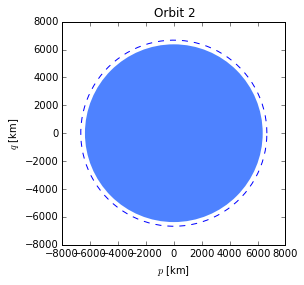
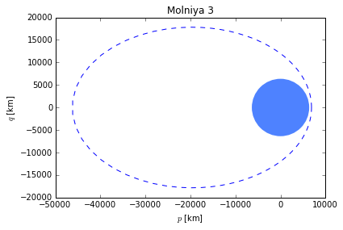

***************
Defining Orbits
***************

.. code:: python

    %matplotlib inline
.. code:: python

    from numpy import radians
    from scipy.constants import kilo
    
    from orbital import KeplerianElements
    from orbital.bodies import earth
    from orbital.plotting import plot
.. code:: python

    # Create circular orbit with 90 minute period
    orbit1 = KeplerianElements.with_period(90 * 60, body=earth)
    plot(orbit1, title='Orbit 1')

.. code:: python

    # Create molniya orbit from period and eccentricity
    from orbital.constants import earth_sidereal_day
    molniya1 = KeplerianElements.with_period(
        earth_sidereal_day / 2, e=0.741, i=radians(63.4), arg_pe=radians(270),
        body=earth)
    
    plot(molniya1, title='Molniya 1')

.. image:: output_3_0.png

.. code:: python

    # Create circular orbit at altitude 300 km
    orbit2 = KeplerianElements.with_altitude(300 * kilo, body=earth)
    plot(orbit2, title='Orbit 2')

.. code:: python

    # Create molniya orbit by specifying altitude at perigee.
    # This works because M0=0 (perigee).
    molniya2 = KeplerianElements.with_altitude(
        508 * kilo, e=0.741, i=radians(63.4), arg_pe=radians(270), body=earth)
    
    plot(molniya2, title='Molniya 2')

.. image:: output_5_0.png

.. code:: python

    # Create orbit by specifying apside altitudes.
    # Note that order of apsides doesn't matter, smallest is used as pericenter
    orbit3 = KeplerianElements.with_apside_altitudes(
        1000 * kilo, 400 * kilo, body=earth)
    
    plot(orbit3, title='Orbit 3')

.. code:: python

    # Create molniya orbit using apside altitudes
    
    molniya3 = KeplerianElements.with_apside_altitudes(
        39873 * kilo, 508 * kilo, i=radians(63.4), arg_pe=radians(270), body=earth)
    
    plot(molniya3, title='Molniya 3')

.. code:: python

    # Create orbit using apside radii
    
    orbit4 = KeplerianElements.with_apside_radii(7000 * kilo, 8400 * kilo, body=earth)
    plot(orbit4, title='Orbit 4')

.. image:: output_8_0.png

