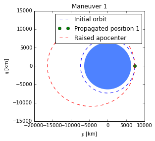
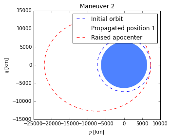
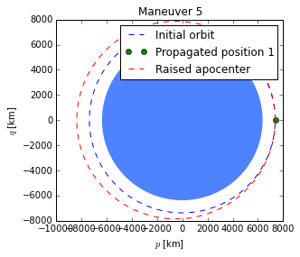
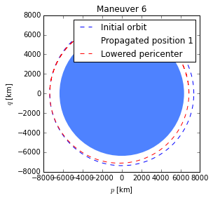
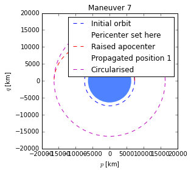
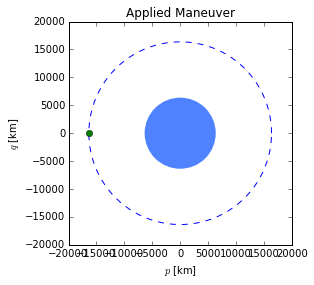

*********
Maneuvers
*********

.. code:: python

    from scipy.constants import kilo
    
    from orbital import KeplerianElements
    from orbital.bodies import earth
    from orbital.maneuver import Maneuver
    from orbital.plotting import plot
Here, we define an orbit and then plot it with several different
maneuvers applied.

**Note:** Plotting an orbit with a maneuver doesn't apply the maneuver
to the original orbit.

.. code:: python

    orbit1 = KeplerianElements.with_altitude(1000 * kilo, body=earth)
.. code:: python

    man1 = Maneuver.set_apocenter_altitude_to(10000 * kilo)
    plot(orbit1, title='Maneuver 1', maneuver=man1)

.. code:: python

    man2 = Maneuver.set_apocenter_radius_to(22000 * kilo)
    plot(orbit1, title='Maneuver 2', maneuver=man2)

.. code:: python

    man3 = Maneuver.set_pericenter_radius_to(6800 * kilo)
    plot(orbit1, title='Maneuver 3', maneuver=man3)

.. image:: output_7_0.png

.. code:: python

    man4 = Maneuver.set_pericenter_altitude_to(500 * kilo)
    plot(orbit1, title='Maneuver 4', maneuver=man4)

.. image:: output_8_0.png

.. code:: python

    man5 = Maneuver.change_apocenter_by(1000 * kilo)
    plot(orbit1, title='Maneuver 5', maneuver=man5)

.. code:: python

    man6 = Maneuver.change_pericenter_by(-500 * kilo)
    plot(orbit1, title='Maneuver 6', maneuver=man6)

.. code:: python

    man7 = Maneuver.hohmann_transfer_to_altitude(10000 * kilo)
    plot(orbit1, title='Maneuver 7', maneuver=man7)

To apply a maneuver, simply use the following method:

.. code:: python

    orbit1.apply_maneuver(man7)
Now orbit can be plotted to show its new state:

.. code:: python

    plot(orbit1, title='Applied Maneuver')

