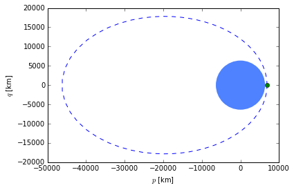
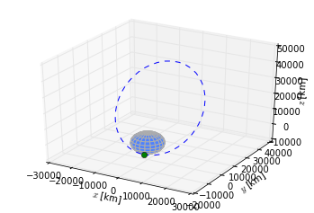
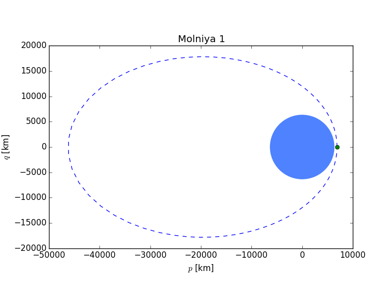
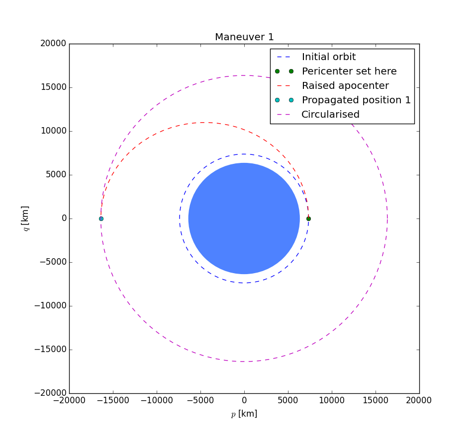
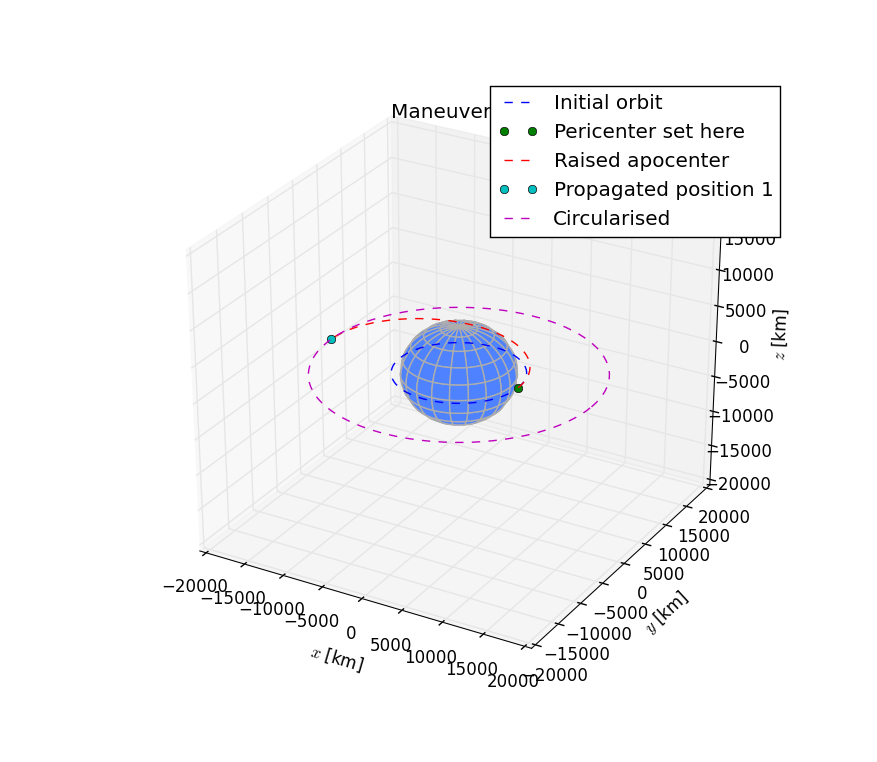

Plotting
========

.. code:: python

    from numpy import radians
    from scipy.constants import kilo

    from orbital import earth, KeplerianElements, Maneuver, plot, plot3d

.. code:: python

    # Create molniya orbit from period and eccentricity
    from orbital import earth_sidereal_day
    molniya = KeplerianElements.with_period(
        earth_sidereal_day / 2, e=0.741, i=radians(63.4), arg_pe=radians(270),
        body=earth)

    # Simple circular orbit
    orbit = KeplerianElements.with_altitude(1000 * kilo, body=earth)

Simple plots
------------

.. code:: python

    plot(molniya)

.. code:: python

    plot3d(molniya)

Animation
---------

.. code:: python

    plot(molniya, title='Molniya 1', animate=True)

.. code:: python

    plot3d(molniya1, title='Molniya 2', animate=True)
.. raw:: html

    

Maneuvers
---------

.. code:: python

    man = Maneuver.hohmann_transfer_to_altitude(10000 * kilo)
.. code:: python

    plot(orbit, title='Maneuver 1', maneuver=man)

.. code:: python

    plot3d(orbit, title='Maneuver 2', maneuver=man)

